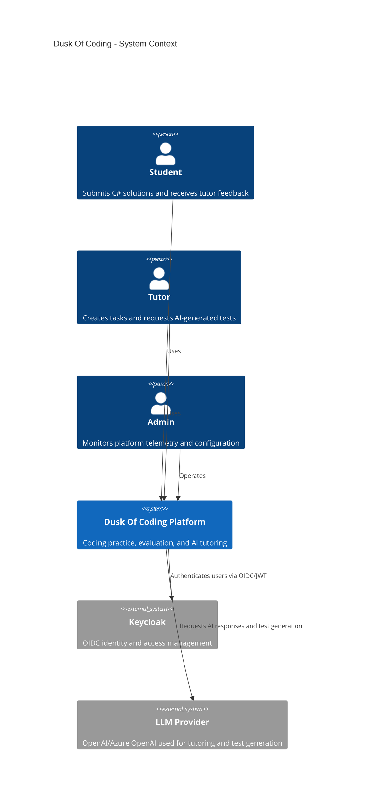
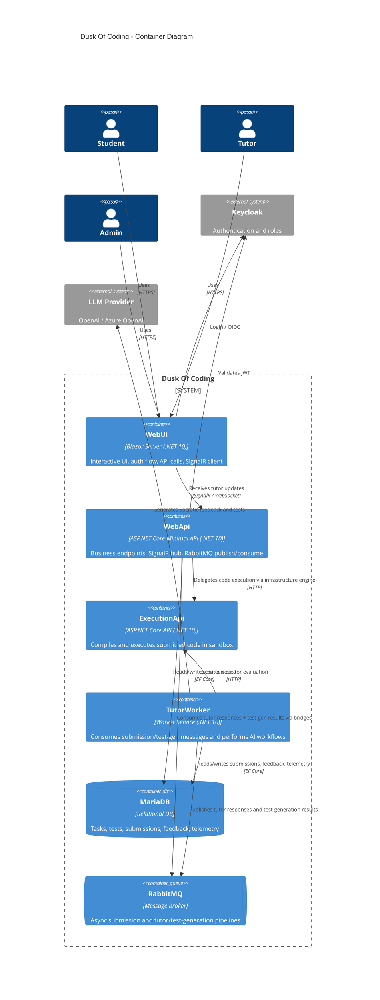
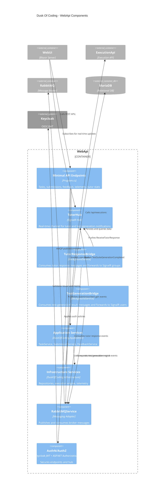
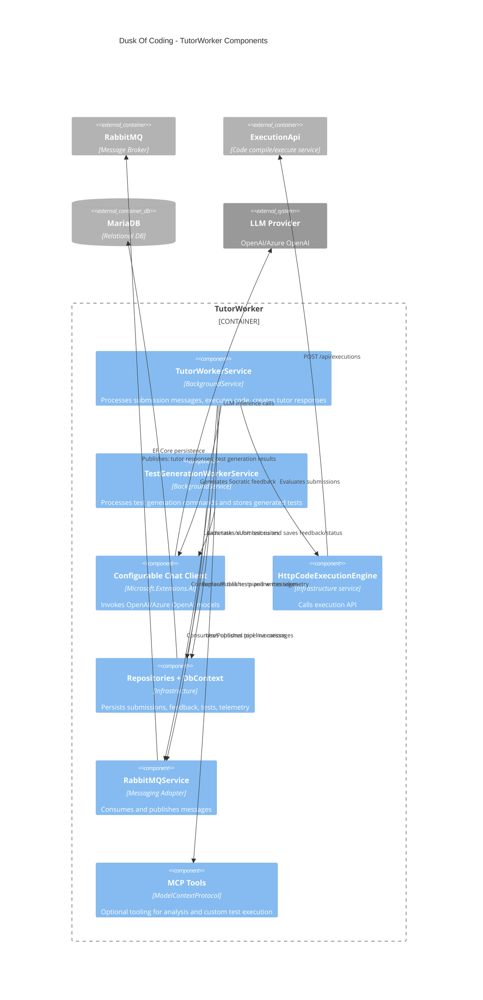

# Dusk Of Coding – C4 Diagrams (Mermaid)

This document contains C4-style diagrams for the current solution using Mermaid syntax.

## 1) System Context

## 2) Container Diagram

## 3) Component Diagram – WebApi Container

## 4) Component Diagram – TutorWorker Container

