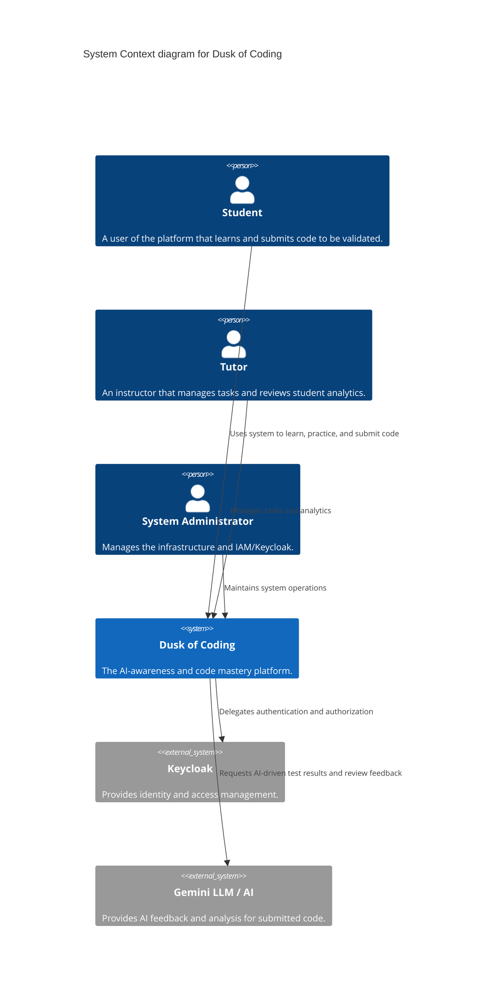
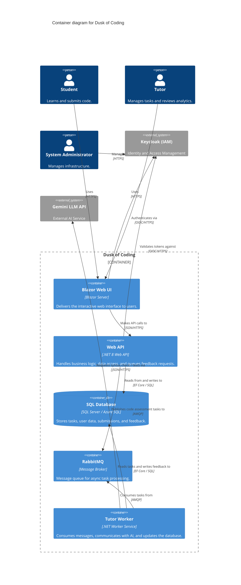

# Dusk of Coding: Deployment and Operations Documentation

## 1. Project Goal & Overview
**Dusk of Coding** is an AI-awareness and code mastery platform designed to bridge the gap between traditional learning and modern, AI-assisted development practices. The platform enables users to submit code, which is then analyzed by an AI (TutorWorker) to provide real-time, Socratic feedback and syntax validation. The goal is not just to teach syntax, but to foster deep technical understanding and proficiency in utilizing AI as a pair programmer.

## 2. Actors
The system is utilized by three primary actors, each with distinct roles and responsibilities:
- **Students**: The primary users of the platform. They engage in learning paths, solve coding challenges, and submit their code for automated AI-driven review.
- **Tutors**: Educational facilitators who create and manage coding tasks, define testing parameters, and review aggregated analytics of student performance and progression.
- **System Administrators**: The IT and operational staff responsible for managing the underlying infrastructure, container orchestrations, configuration management, and Identity and Access Management (IAM) through Keycloak.

## 3. C4 Architecture

### Level 1: System Context


### Level 2: Container


### Interactions Summary
- **Blazor UI**: Provides the interactive frontend for students and tutors.
- **WebAPI**: Serves as the core backend, handling CRUD operations for tasks and routing requests.
- **Keycloak**: Acts as the centralized IAM, handling all user authentication and authorization via OIDC.
- **RabbitMQ**: The message broker that ensures asynchronous, decoupled processing for heavy AI operations.
- **TutorWorker**: A background service that picks up messages from RabbitMQ, interacts with the external AI (e.g., Gemini), and processes the feedback asynchronously before updating the database.

## 4. Operations & Deployment Strategies
### Scenario A: Azure Cloud Deployment
For a cloud-native approach, the platform leverages Azure's managed services.
- **Hosting**: Deploy the **Blazor UI** and **WebAPI** using **Azure App Service** or **Azure Container Apps** for scalable, managed hosting. Container Apps are preferred if a microservices topology is desired. The **TutorWorker** can run as a background worker within Azure Container Apps.
- **Database**: Use **Azure SQL Database** for a highly available relational data store. Ensure firewall rules and Managed Identities are configured for secure access from the API and Worker.
- **Messaging**: Replace or bridge RabbitMQ with **Azure Service Bus** to fully utilize Azure's native queuing capabilities without managing broker infrastructure.
- **Identity**: Since Keycloak is a containerized application, it can be hosted on a dedicated Azure Container App or an Azure Virtual Machine, configured with a high-availability persistent volume for its internal PostgreSQL DB.

### Scenario B: On-Premise Windows (IIS/WAS)
For environments where strict data governance mandates on-premise hosting over Windows Server.
- **Web Applications**: Host the **Blazor Server UI** and **WebAPI** within Internet Information Services (**IIS**). Ensure the required .NET Hosting Bundle is installed and application pools are configured for "No Managed Code" if using out-of-process hosting, or strictly managed environments.
- **Background Worker**: Install and configure the **TutorWorker** project as a native **Windows Service** using the `WindowsService` extensions for .NET.
- **Database**: Host the backend on **SQL Server** (Standard or Enterprise edition). Configure appropriate connection strings utilizing Windows Authentication (`Integrated Security=true`) where possible.
- **Identity (Keycloak) via Reverse Proxy**: Run Keycloak either as a bare-metal Java application or within a Docker container on a Windows host. Configure IIS with the **URL Rewrite** module and Application Request Routing (ARR) to act as a **Reverse Proxy**, correctly forwarding headers (`X-Forwarded-For`, `X-Forwarded-Proto`) to ensure OIDC redirect URIs resolve over HTTPS.

### Scenario C: Fully Containerized (Docker/K8s)
For highly scalable, portable, and cloud-agnostic deployments.
- **Staging / Local**: Utilize **Docker Compose** to spin up the entire stack—Blazor UI, WebAPI, TutorWorker, SQL Server (via `mcr.microsoft.com/mssql/server`), Keycloak, and RabbitMQ—within an internal Docker network.
- **Production**: Deploy to a **Kubernetes (K8s)** cluster using **Helm charts**.
  - **Deployments**: Create separate deployments for the WebAPI, Blazor UI, and TutorWorker. The TutorWorker deployment should scale based on RabbitMQ queue length (using KEDA).
  - **StatefulSets**: If hosting databases within the cluster, use StatefulSets with Persistent Volume Claims (PVCs) for RabbitMQ and Keycloak's backing PostgreSQL database. (External managed databases are recommended for production SQL).
  - **Ingress**: Configure an Ingress controller (e.g., NGINX) to route external traffic to the UI and WebAPI, orchestrating required SSL/TLS termination using cert-manager.

## 4.1. Step-by-Step Runbooks

### A. Azure Cloud Deployment (Azure Container Apps)
- Create a Resource Group and an Azure Container Registry (ACR) using the Azure CLI (`az`):
  ```bash
  az group create --name MyResourceGroup --location westeurope
  az acr create --resource-group MyResourceGroup --name MyRegistry --sku Basic
  ```
- Build and push the `WebAPI` and `TutorWorker` images using the `az acr build` command:
  ```bash
  az acr build --registry MyRegistry --image webapi:latest ./DuskOfCoding.WebApi
  az acr build --registry MyRegistry --image tutorworker:latest ./DuskOfCoding.TutorWorker
  az acr build --registry MyRegistry --image webui:latest ./DuskOfCoding.WebUi
  ```
- Install the Entity Framework Core CLI tool if not already present on the build agent:
  ```bash
  dotnet tool install --global dotnet-ef
  ```
- Run the Entity Framework Core migration from the CLI using the following command:
  ```bash
  dotnet ef database update --project DuskOfCoding.Infrastructure --startup-project DuskOfCoding.WebApi
  ```
- Create the Container App based on the pushed images.
- **Warning (What can break):** Ensure that the `TutorWorker` is strictly configured with `--min-replicas 1`. Without this, the "Scale to zero" feature will terminate the worker, causing RabbitMQ queues to fill up with unprocessed messages. Ensure KEDA (Kubernetes Event-Driven Autoscaling) is properly configured if your workloads require backpressure management during high load.

### B. On-Premise Windows (IIS / Windows Service)
- Publish the projects using the following PowerShell/CLI command:
  ```powershell
  dotnet publish -c Release
  ```
- **IIS setup:** Create an Application Pool configured with "No Managed Code" (since Kestrel runs out-of-process) and assign the necessary folder permissions to the application directory.
- **IIS Reverse Proxy & Keycloak:** When using Keycloak behind an IIS Reverse Proxy, you MUST configure the ASP.NET Core `ForwardedHeaders` middleware in the `Program.cs` before `.UseAuthentication()`. Furthermore, enable `HTTP_X_FORWARDED_PROTO` in IIS URL Rewrite rules to avoid OIDC redirect loops.
- Create and start the TutorWorker as a Windows Service using `sc.exe create`:
  ```powershell
  sc.exe create TutorWorker binPath= "C:\path\to\publish\DuskOfCoding.TutorWorker.exe" start= auto
  sc.exe start TutorWorker
  ```
- **Warning (What can break):** The IIS AppPool Identity often lacks the required permissions to read the Windows Certificate Store or specific Environment Variables. This can result in JWT validation failing with a "Signature validation failed" error. To prevent this, enable the "Load User Profile = True" setting on the Application Pool.

### C. Docker Compose (Staging / Quick Deploy)
- Prepare the environment by creating an `.env` file for secrets (e.g., `DB_PASSWORD`, `GEMINI_API_KEY`).
  > **Note**: Be sure to define memory limits for your services in `docker-compose.yml`, particularly for `executionapi` where the Roslyn sandbox runs, to prevent out-of-memory (OOM) cascades in the container host.
- Start the system using the appropriate startup command:
  ```bash
  docker-compose up -d --build
  ```
- **Warning (What can break):** "Race conditions" during startup can be a critical point of failure. It is particularly important that the `docker-compose.yml` uses the `depends_on` directive with `condition: service_healthy`. This ensures that MariaDB and RabbitMQ are fully operational before the WebAPI or Worker attempts to connect using their Connection Strings.

## 4.2. Mandatory Environment Variables

To ensure the platform operates securely and robustly across all orchestrated environments (Docker, Azure, IIS), the following environment variables **must** be injected into both the `WebApi` and `TutorWorker` containers/processes:

### Core System
- `ASPNETCORE_ENVIRONMENT`: Must be set to `Production`. Without this, internal health checks will remain offline by default, causing orchestration networks to terminate containers indefinitely.
- `ConnectionStrings__DefaultConnection`: The primary MariaDB connection string for robust system persistence.
- `ConnectionStrings__rabbitmq`: The AMQP broker connection string handling asynchronous AI task dispatching.

### AI Mentor (LlmProvider)
- `LlmProvider__Provider`: Defines the active AI API provider (e.g., `Gemini`, `OpenAI`, or `AzureOpenAI`).
- `LlmProvider__ModelId`: The specific model engine to use (e.g., `gemini-3-flash-preview` or `gpt-4o`).
- `LlmProvider__GeminiApiKey` (or `LlmProvider__OpenAIApiKey`): The secure API key for the chosen LLM provider. **Never hardcode this in `appsettings.json`.**

### Identity (Keycloak)
- `Keycloak__Authority`: The trusted OIDC issuer URL (e.g., `https://keycloak.your-domain.com/realms/DuskOfCoding`). For Azure Container Apps, ensure this points to the external ingress host if token issuers require validation.

## 5. Monitoring & Maintenance
- **Observability with LlmTelemetryLog**:
  The system tracks AI-driven code evaluations via the `LlmTelemetryLog` entity. This provides deep observability into token utilization, AI response latency, and generation anomalies. Administrators should query this table periodically or stream its logs to an external dashboard (like Grafana or Application Insights) to monitor AI cost and efficiency.
- **Log Rotation**:
  Ensure application logging (e.g., Serilog) is configured with file rippling and log rotation policies to prevent disk exhaustion. For containerized deployments, stream logs to `stdout`/`stderr` and let the container orchestrator (Fluentd or Logstash) handle retention.
- **Health Check Endpoints**:
  All services (WebAPI, UI, TutorWorker) must expose standardized `/health` and `/health/ready` endpoints via ASP.NET Core Health Checks. These endpoints should actively probe database connectivity, RabbitMQ channels, and Keycloak's OIDC discovery document. The load balancers and orchestrators must use these endpoints to remove unhealthy nodes from rotation and prevent service Deadlocks.
  > **Critical Config Warning:** By default, `.MapHealthChecks()` is wrapped in `if (app.Environment.IsDevelopment())` in `ServiceDefaults/Extensions.cs`. You MUST set `ASPNETCORE_ENVIRONMENT=Production` and modify this initialization logic to enable health checks in staging/production environments.
