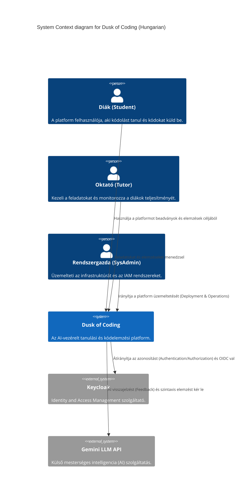
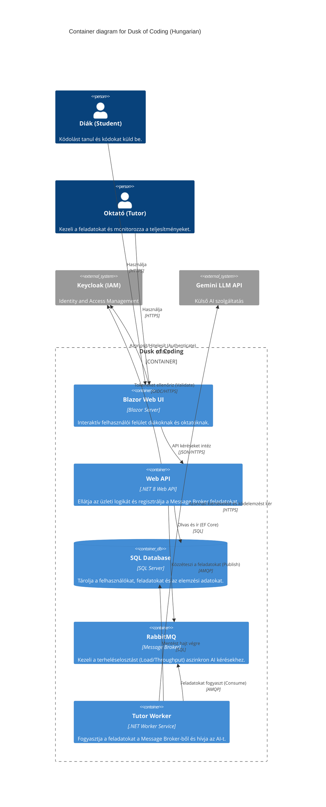

# Dusk of Coding: Telepítési és Üzemeltetési Dokumentáció

## 1. A Projekt Célja és Áttekintése
A **Dusk of Coding** egy AI-vezérelt tanulási és kódolási platform, amely áthidalja a szakadékot a hagyományos oktatás és a modern, AI-támogatott fejlesztési módszertanok között. A rendszer lehetővé teszi, hogy a felhasználók kódot küldjenek be, amelyet a háttérben egy mesterséges intelligencia (TutorWorker) kielemez. Ezzel valós idejű, ún. "szókratészi" visszajelzést (Socratic feedback) és szintaktikai ellenőrzést (syntax validation) biztosít. A fő cél nem csupán a programozás alapjainak megtanítása, hanem egy mély technikai megértés kialakítása és a "pair programmer" (páros programozó) AI-készségek elsajátítása.

## 2. Szereplők (Actors)
A rendszert három fő felhasználói csoport alkalmazza, világosan elkülönülő jogosultságokkal:
- **Diákok (Students)**: A platform elsődleges felhasználói. Tanulási útvonalakon haladnak végig, kódolási feladatokat oldanak meg, és a kódjukat beküldik az automatizált AI-elemző rendszerbe.
- **Oktatók (Tutors)**: Az oktatási folyamatok irányítói. Ők hozzák létre és kezelik a feladatokat (tasks), határozzák meg a tesztelési paramétereket, valamint elemzik a diákok teljesítményét és fejlődését összesítő statisztikákon keresztül.
- **Rendszergazdák (System Administrators)**: Az IT-üzemeltetési és infrastrukturális szakemberek, akik felelősek a platform karbantartásáért, a Containerization technológiák kezeléséért, a hálózatbiztonságért, valamint az Identity and Access Management (IAM) folyamatokért a Keycloak segítségével.

## 3. C4 Architektúra

### Level 1: System Context


### Level 2: Container


### Interakciók Összefoglalója
- **Blazor UI**: Az interaktív frontend a diákok és oktatók számára.
- **WebAPI**: A rendszer core backendje. Kezeli a CRUD műveleteket és irányítja a kéréseket.
- **Keycloak**: A központi Identity and Access Management (IAM) felület. Minden hitelesítési (authentication) és jogosultságkezelési (authorization) folyamatot OIDC alapon szolgáltat.
- **RabbitMQ**: A Message Broker, ami garantálja a leválasztott (decoupled), aszinkron feldolgozást a nagy erőforrás-igényű AI kérések esetében.
- **TutorWorker**: Egy háttérszolgáltatás, amely leemeli az üzeneteket a RabbitMQ-ról, kommunikál a külső AI szolgáltatással (pl. Gemini), és a válasz feldolgozása után frissíti az adatbázist.

## 4. Üzemeltetési és Telepítési Stratégiák (Deployment Strategies)

### A Forgatókönyv: Azure Cloud Deployment
A felhő-natív arhitektúra esetén a rendszer az Azure felhőszolgáltatásaira támaszkodik a maximális rendelkezésre állás érdekében.
- **Kiszolgálás (Hosting)**: A **Blazor UI** és a **WebAPI** az **Azure App Service** vagy az **Azure Container Apps** szolgáltatásokon futtatható. A mikroszolgáltatás-alapú topológia (microservices) esetén a Container Apps az optimális választás. A **TutorWorker** háttérfolyamatként futtatható ugyanitt.
- **Adatbázis**: Relációs adatbázisként használjon **Azure SQL** felhőszolgáltatást. A biztonságos hozzáférés érdekében konfigurálja megfelelően a tűzfalszabályokat (Firewall rules) és a Managed Identity-t az API és a Worker számára.
- **Üzenetküldés (Messaging)**: Igény szerint a RabbitMQ kicserélhető **Azure Service Bus**-ra, ezzel a Message Broker infrastruktúra üzemeltetése tehermentesíthető.
- **Azonosítás**: Mivel a Keycloak egy Containerized applikáció, könnyen futtatható dedikált Azure Container App-on vagy Azure VM-en, egy tartós tárhellyel (Persistent Volume) a saját belső PostgreSQL adatbázisának.

### B Forgatókönyv: On-Premise Windows (IIS/WAS)
Szigorú adatkezelési protokollok esetén, amikor a platformot saját Windows Server infrastruktúrán (On-Premise) kell hosztolni.
- **Webes alkalmazások**: A **Blazor Server UI** és a **WebAPI** beállítása Internet Information Services (**IIS**) segítségével. Győződjön meg róla, hogy a megfelelő .NET Hosting Bundle telepítve van, valamint az Application Pool-ok beállítása optimális.
- **Háttérszolgáltatások (Background Worker)**: A **TutorWorker** alkalmazást dedikált **Windows Service**-ként kell telepíteni a .NET `WindowsService` kiterjesztéseivel.
- **Adatbázis**: A háttéradatbázist egy **SQL Server** kiszolgálón (Standard vagy Enterprise kiadás) hosztolja. Indokolt esetben a Windows hitelesítés (Integrated Security) preferált.
- **Keycloak és a Reverse Proxy**: A Keycloak futtatható önálló Java alkalmazásként vagy Docker tárolóban egy Windows host szerveren. Az IIS-ben alkalmazza az **URL Rewrite** és Application Request Routing (ARR) modulokat **Reverse Proxy**-ként. Fontos, hogy a proxy a megfelelő HTTP fejléceket (`X-Forwarded-For`, `X-Forwarded-Proto`) pontosan továbbítsa a biztonságos OIDC kommunikáció megteremtéséhez, valamint elkerülje a hitelesítési ciklusokat (Deadlock).

### C Forgatókönyv: Teljesen Konténerizált (Docker/K8s) Deployment
Rendkívül dinamikusan skálázható, hordozható és szolgáltató-független (cloud-agnostic) megoldás.
- **Tesztelési (Staging) és Lokális környezet**: **Docker Compose** használatával a teljes rendszer elindítható—beleértve a Blazor UI, WebAPI, TutorWorker, SQL Server (`mssql/server`), Keycloak és RabbitMQ komponenseket—egy zárt, belső Docker hálózaton.
- **Éles/Produkciós (Production) környezet**: A rendszert egy **Kubernetes (K8s)** klaszteren implementáljuk **Helm chartok** segítségével.
  - **Deployments**: A WebAPI, a UI és a TutorWorker külön deployment-ként üzemel. A TutorWorker podszámának autoscale mechanizmusát a RabbitMQ queue telítettségéhez kell kötni (például KEDA segítségével).
  - **Állapottartó komponensek (StatefulSets)**: A RabbitMQ és a Keycloak postgres alrendszere StatefulSet-ként definiálandó, Persistent Volume Claim (PVC) hozzárendeléssel. Jobb Throughput eléréséhez az adatbázis külső szolgáltatóra is bízható.
  - **Hálózatkezelés**: Szabályozza a bejövő forgalmat egy Ingress controller (pl. NGINX) használatával, amely az SSL/TLS termináció is végzi és az útvonalakat a UI felé, illetve a WebAPI felé szétosztja.

## 4.1. Step-by-Step Runbooks

### A. Azure Cloud Deployment (Azure Container Apps)
- Hozzon létre egy Resource Group-ot és egy Azure Container Registry (ACR) példányt az Azure CLI (`az`) használatával:
  ```bash
  az group create --name MyResourceGroup --location westeurope
  az acr create --resource-group MyResourceGroup --name MyRegistry --sku Basic
  ```
- Fordítsa le (build) és töltse fel (push) a `WebAPI` és `TutorWorker` image-eket az `az acr build` paranccsal:
  ```bash
  az acr build --registry MyRegistry --image webapi:latest ./DuskOfCoding.WebApi
  az acr build --registry MyRegistry --image tutorworker:latest ./DuskOfCoding.TutorWorker
  az acr build --registry MyRegistry --image webui:latest ./DuskOfCoding.WebUi
  ```
- Telepítse az Entity Framework Core CLI eszközt a migráció előtt, ha még nincs a build szerveren:
  ```bash
  dotnet tool install --global dotnet-ef
  ```
- Futtassa az Entity Framework Core migrációt CLI-ből a következő paranccsal:
  ```bash
  dotnet ef database update --project DuskOfCoding.Infrastructure --startup-project DuskOfCoding.WebApi
  ```
- Hozza létre a Container App-ot a feltöltött image-ek alapján.
- **Figyelmeztetés (Kritikus hibaforrás):** Figyeljen arra, hogy a `TutorWorker` esetén a Container App-ot kötelezően `--min-replicas 1` beállítással kell konfigurálni. Ellenkező esetben a "Scale to zero" funkció leállítja a workert, aminek következtében a RabbitMQ queue-k felhalmozódnak feldolgozatlan üzenetekkel. Biztosítsa továbbá, hogy a KEDA (Kubernetes Event-Driven Autoscaling) helyesen legyen konfigurálva a túlzott terhelés okozta RabbitMQ backpressure kezelésére.

### B. On-Premise Windows (IIS / Windows Service)
- Publikálja a projekteket az alábbi PowerShell/CLI paranccsal:
  ```powershell
  dotnet publish -c Release
  ```
- **IIS setup:** Hozzon létre egy Application Pool-t "No Managed Code" beállítással (mivel a Kestrel out-of-process fut), majd rendelje hozzá a szükséges folder permissions beállításokat az alkalmazás mappájához.
- **IIS Reverse Proxy & Keycloak:** On-Premise környezetben, ahol az IIS proxy-z a Keycloak felé, a WebAPI `Program.cs` fájljában KÖTELEZŐ beállítani a `ForwardedHeaders` middleware-t az `.UseAuthentication()` előtt. Az IIS URL Rewrite szabályokban pedig engedélyeznie kell a `HTTP_X_FORWARDED_PROTO` headert, különben OIDC redirect loop (végtelen átirányítás) alakul ki.
- Hozza létre és indítsa el a TutorWorker-t mint Windows Service az `sc.exe create` használatával:
  ```powershell
  sc.exe create TutorWorker binPath= "C:\path\to\publish\DuskOfCoding.TutorWorker.exe" start= auto
  sc.exe start TutorWorker
  ```
- **Figyelmeztetés (Kritikus hibaforrás):** Az IIS AppPool Identity gyakran nem rendelkezik megfelelő jogosultságokkal a Windows Certificate Store vagy bizonyos Environment Variables olvasásához. Ez azt eredményezheti, hogy a JWT token érvényesítése sikertelen lesz "Signature validation failed" hibával. Ennek megelőzése érdekében engedélyezze a "Load User Profile = True" opciót az Application Pool beállításaiban.

### C. Docker Compose (Staging / Quick Deploy)
- Készítse elő a környezetet azáltal, hogy létrehoz egy `.env` fájlt a secrets számára (például `DB_PASSWORD`, `GEMINI_API_KEY`).
  > **Megjegyzés**: Szabályozza szigorúan a konténerek memóriahasználatát (memory limits) a `docker-compose.yml` fájlban, különösen az `executionapi` esetében (ahol a Roslyn compiler fut), így megelőzhetőek az Out-Of-Memory (OOM) leállások és a host szerver stabilitásának veszélyeztetése.
- Indítsa el a rendszert a megfelelő startup command segítségével:
  ```bash
  docker-compose up -d --build
  ```
- **Figyelmeztetés (Kritikus hibaforrás):** A rendszer indításakor kritikus hibaforrást jelenthetnek a "Race conditions" (versenyhelyzetek). Hangsúlyozandó, hogy a `docker-compose.yml` konfigurációban kötelező a `depends_on` paramétert `condition: service_healthy` értékkel használni. Ez garantálja, hogy a MariaDB és a RabbitMQ teljes mértékben készen áll a kérések fogadására, mielőtt a WebAPI vagy a Worker megkísérelne csatlakozni hozzájuk.

## 4.2. Kötelező Környezeti Változók (Environment Variables)

A platform biztonságos és stabil működése érdekében az alábbi környezeti változókat **kötelező** injektálni mind a `WebAPI`, mind a `TutorWorker` konténerekbe/folyamatokba az operációs környezettől függetlenül (Docker, Azure, IIS):

### Alapvető Konfiguráció (Core)
- `ASPNETCORE_ENVIRONMENT`: Kötelező értéke `Production`. Ennek hiányában a Health Check végpontok inaktívak maradnak, ami miatt az orchestrator rendszerek (pl. Azure Container Apps) folyamatosan újraindítják a konténereket.
- `ConnectionStrings__DefaultConnection`: A MariaDB adatbázis kapcsolati sztringje a stabil háttértároláshoz.
- `ConnectionStrings__rabbitmq`: Az AMQP broker kapcsolati sztringje, amely biztosítja az aszinkron AI-feladatok ütemezését.

### Szókratészi AI Mentor (LlmProvider)
- `LlmProvider__Provider`: Az aktív mesterséges intelligencia szolgáltató (pl. `Gemini`, `OpenAI`, vagy `AzureOpenAI`).
- `LlmProvider__ModelId`: A használni kívánt specifikus modell azonosítója (pl. `gemini-3-flash-preview` vagy `gpt-4o`).
- `LlmProvider__GeminiApiKey` (vagy `LlmProvider__OpenAIApiKey`): A kiválasztott LLM szolgáltatóhoz tartozó titkosított API kulcs. **Ezt soha ne hardkódolja az `appsettings.json` fájlba.**

### Hitelesítés (Keycloak)
- `Keycloak__Authority`: A megbízható OIDC kibocsátó URL-je (pl. `https://keycloak.your-domain.com/realms/DuskOfCoding`). Azure Container Apps esetén győződjön meg róla, hogy ez a publikus ingress hostra mutat a helyes token-validáció érdekében.

## 5. Monitorozás és Karbantartás (Monitoring & Maintenance)
- **Megfigyelhetőség (Observability) a LlmTelemetryLog-gal**:
  A rendszer külön nyilvántartást vezet (`LlmTelemetryLog`) a mesterséges intelligencia-vezérelt elemzésekről. Ez létfontosságú Observability mutatószámokat jelent a tokenfelhasználás (token throughput), válaszidők és predikciós anomáliák esetében. Az üzemeltetők monitorozó rendszerekkel (Grafana, Datadog) tudják vizualizálni a logokat, hogy elkerüljék a túlzott AI-hívások okozta rejtett költségeket.
- **Log Forgatás (Log Rotation)**:
  A naplózó rendszereket (pl. Serilog) olyan File Rotation szabályokkal és méretkorlátokkal kell ellátni, amelyek meggátolják a teljes disk tárhely kimerülését. Konténeres Deployment (Containerization) esetén irányítsa a naplózást egyenesen a `stdout` és `stderr` csatornákra, amit majd a Kubernetes-ben konfigurált agent (Fluentd/Promtail) begyűjt.
- **Health Check Endpontok**:
  A platform összes szolgáltatása (WebAPI, UI, TutorWorker) szabványos `/health` és `/health/ready` végpontokkal (endpoints) rendelkezik. Ezek dinamikusan validálják a háttérkapcsolatokat, mint például az adatbázis elérést, RabbitMQ csatornák állapotát és a Keycloak szerver elérhetőségét. Ezek segédletével a Load Balancer garantálhatja, hogy egy hibás processz ne okozhasson leállást (Deadlock) a teljes kérelem-kiértékelési hálózatban.
  > **Kritikus Konfigurációs Figyelmeztetés:** Alapértelmezés szerint a `ServiceDefaults/Extensions.cs` kódjában a Health Check végpontok regisztrációja egy `if (app.Environment.IsDevelopment())` blokkba van burkolva. Production környezetben a `/health` végpontok alapértelmezetten le vannak tiltva! Ezt a kondíciót feltétlenül távolítsa el az éles architektúrába helyezéskor, különben az orchestrator-ok (pl. Azure Container Apps) "unhealthy" jelzéssel folyamatosan újraindítják a tárolókat.
