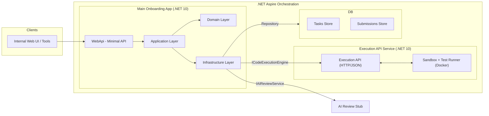

## 1. Fázis – Architektúra

### 1. Áttekintés

- **Cél**: Egy belső használatú, .NET 10 alapú, strukturálisan helyes, de még POC szintű junior onboarding platform architektúrájának meghatározása, amely:
  - Programozási feladatokat tud megjeleníteni
  - C# kódot fogad a felhasználótól
  - A kódot sandboxolt környezetben lefordítja és futtatja
  - Egységteszteket futtat a beküldött megoldás ellen
  - Strukturált visszajelzést ad (nem csak pass/fail)
  - Később AI‑alapú review lépéssel bővíthető

- **Nem cél**:
  - Teljes körű, production‑kész rendszer kialakítása
  - Mikroszervizek, Kubernetes vagy elosztott architektúra bevezetése

---

### 2. Architektúrális stílus

- **Összkép**: **Moduláris monolit Clean Architecture határokkal**
  - **Miért moduláris monolit?**
    - Belső, egy node‑on futó POC; a mikroszervizek csak felesleges komplexitást hoznának.
    - Egyszerűbb fejlesztés, hibakeresés, üzembe helyezés.
    - A modulhatárok (Tasks, Submissions, Execution) világosak, és szükség esetén később szétbonthatók külön szolgáltatásokra.
  - **Miért Clean Architecture?**
    - A domain logika független a keretrendszerektől és az infrastruktúrától.
    - Lehetővé teszi az execution engine (pl. Docker sandbox) és az AI review szolgáltató cseréjét a domain módosítása nélkül.
    - A Web API réteg vékony marad, főleg HTTP‑specifikus feladatokkal.

---

### 3. High-Level architektúra diagram

- **Mermaid diagram (high level)**:



- **Szöveges összefoglaló**:

  - **Clients**: Belső webes UI vagy egyéb eszközök, amelyek HTTP/JSON‑on keresztül hívják a fő Web API‑t.
  - **MainApp**: Tartalmazza a Web API, Application, Domain és Infrastructure rétegeket.
  - **ExecService**: Különálló Execution API, amely JSON kérést kap, kódot futtat sandboxban, és JSON választ ad vissza.
  - **Database**: A feladatokat (Tasks) és a beküldéseket (Submissions) tárolja.
  - **Aspire**: Konfiguráció‑mint‑kód módon együtt kezeli a fő alkalmazást, az Execution API‑t és az adatbázist.

---

### 4. Fő komponensek és felelősségek

- **Tasks modul**
  - **Domain**:
    - `Task` entitás (cím, leírás, nehézségi szint, tagek, tesztcsomag hivatkozás)
    - `ITaskRepository` interfész
  - **Application**:
    - Use case‑ek: feladatok listázása, feladat lekérése azonosító alapján
  - **Infrastructure**:
    - Feladat tároló (JSON/YAML fájlok vagy adatbázis)
    - POC szinten a feladatok betöltése induláskor, cache‑elés

- **Submissions modul**
  - **Domain**:
    - `Submission` entitás (task azonosító, opcionális user azonosító, forráskód, státusz, időbélyegek)
    - `ISubmissionRepository` interfész
  - **Application**:
    - Use case‑ek: beküldés létrehozása, beküldés lekérése azonosító alapján
  - **Infrastructure**:
    - Beküldések és a hozzájuk tartozó `ExecutionResult` állapotok tárolása

- **Execution modul**
  - **Domain**:
    - `ExecutionResult` (fordítási eredmények, teszteredmények, futási adatok)
    - `Feedback` (strukturált visszajelzés, összefoglaló, üzenetek)
    - `ICodeExecutionEngine` interfész
    - `IAIReviewService` interfész
  - **Application**:
    - Beküldés esetén:
      - A `Submission` elmentése
      - A `ICodeExecutionEngine` meghívása, amely HTTP/JSON kérést küld a külső Execution API felé
      - Opcionálisan az `IAIReviewService` meghívása, hogy gazdagítsa a `Feedback`‑et
      - Az eredmény és a visszajelzés mentése, majd visszaadása az API rétegnek
  - **Infrastructure**:
    - `HttpCodeExecutionEngine` implementáció, amely:
      - JSON‑né szerializálja az execution kérést
      - Elküdli az Execution API végpontjára (pl. `POST /api/executions`)
      - A JSON választ visszaalakítja `ExecutionResult` domain modellé
    - `NoOpAIReviewService` POC szinten (nem végez valós AI‑elemzést)

  - **Végrehajtás külső API‑n keresztül**:
    - Az `ICodeExecutionEngine` egy tiszta API határt reprezentál.
    - A konkrét implementáció egy HTTP kliens a dedikált Execution API felé.
    - Az `Application` és `Domain` rétegek változatlanok maradhatnak akkor is, ha az Execution API‑t áthelyezzük, skálázzuk vagy újraimplementáljuk.

---

### 5. Rétegek és függőségi szabályok

- **Rétegek közötti szabályok**:
  - `Domain` → nem függ semmilyen más rétegtől.
  - `Application` → csak a `Domain`‑től függ.
  - `WebApi` → az `Application`‑től függ (és azon keresztül a Domain contractoktól).
  - `Infrastructure` → a `Domain` interfészeit implementálja, és a `WebApi` regisztrálja DI‑n keresztül.

- **Sandbox / izolációs határ**:
  - Csak az `Infrastructure` rétegben lévő `ICodeExecutionEngine` implementáció kommunikál az Execution API‑val és azon keresztül a Docker / OS szinttel.
  - A `Domain` és `Application` rétegek kizárólag absztrakt szerződéseket (`ICodeExecutionEngine`, `ExecutionResult`, `Feedback`) és strukturált adatot látnak.
  - Így a konkrét sandbox megoldás (Docker, más konténer, külön szolgáltatás) később cserélhető a belső logika módosítása nélkül.

---

### 6. Fő bővítési pontok (interfészek)

- **Repository‑k és szolgáltatások (Domain rétegbeli interfészek)**:

```csharp
public interface ITaskRepository
{
    Task<IReadOnlyList<TaskDefinition>> GetAllAsync(CancellationToken ct = default);
    Task<TaskDefinition?> GetByIdAsync(Guid id, CancellationToken ct = default);
}

public interface ISubmissionRepository
{
    Task<Submission> AddAsync(Submission submission, CancellationToken ct = default);
    Task<Submission?> GetByIdAsync(Guid id, CancellationToken ct = default);
    Task UpdateAsync(Submission submission, CancellationToken ct = default);
}

public interface ICodeExecutionEngine
{
    Task<ExecutionResult> ExecuteAsync(
        TaskDefinition task,
        Submission submission,
        CancellationToken ct = default);
}

public interface IAIReviewService
{
    Task<Feedback> EnrichFeedbackAsync(
        TaskDefinition task,
        Submission submission,
        ExecutionResult executionResult,
        CancellationToken ct = default);
}
```

- **AI review mint opcionális, cserélhető lépés**:
  - POC szinten a `IAIReviewService` egy semleges vagy üres extra `Feedback`‑et ad vissza.
  - Később lecserélhető valós AI providerre anélkül, hogy:
    - az API endpointokat,
    - a domain entitásokat,
    - vagy az Application use case szerződéseit módosítani kellene.

---

### 7. Execution API JSON szerződés (high-level)

- **Kérés (a fő alkalmazástól az Execution API felé)** – példa:

```json
{
  "taskId": "00000000-0000-0000-0000-000000000000",
  "submissionId": "11111111-1111-1111-1111-111111111111",
  "sourceCode": "public class Solution { /* ... */ }",
  "language": "csharp",
  "testBundle": {
    "framework": "xunit",
    "projectTemplatePath": "tasks/arrays/sum/tests.csproj"
  },
  "limits": {
    "cpuSeconds": 5,
    "memoryMb": 256,
    "wallClockSeconds": 15
  }
}
```

- **Válasz (az Execution API‑tól a fő alkalmazás felé)** – példa:

```json
{
  "submissionId": "11111111-1111-1111-1111-111111111111",
  "status": "Completed",
  "compilation": {
    "succeeded": true,
    "errors": []
  },
  "tests": [
    {
      "name": "Sum_TwoPositiveNumbers_ReturnsCorrectResult",
      "passed": true,
      "message": null,
      "durationMs": 12
    }
  ],
  "runtime": {
    "totalDurationMs": 1234
  },
  "errors": []
}
```

Az `HttpCodeExecutionEngine` a fő alkalmazáson belül ezen JSON szerződések és a belső `ExecutionResult` domain modell között végez oda‑vissza leképezést.

---

### 8. Hosting és konfiguráció .NET Aspire‑rel

- A **.NET Aspire** szolgál konfiguráció‑mint‑kód és orkchesztrációs rétegként az alábbiakhoz:
  - A **fő onboarding alkalmazás** (Web API)
  - Az **Execution API** szolgáltatás
  - Az **adatbázis** (pl. SQL/SQLite konténer vagy elérhető példány)

- Aspire fő feladatai:
  - A három komponens (main app, execution service, DB) erőforrásként való definiálása kódból.
  - Konfiguráció (connection stringek, base URL‑ek, secretek) összekötése erős típusosságú Resource‑okon keresztül.
  - A teljes fejlesztői környezet egyszerű felhúzása egyetlen parancsból.

Ez a dokumentum a 1. fázis (architektúra) magyar nyelvű összefoglalója, a fogalmi neveket és kódpéldákat (`Task`, `Submission`, `ExecutionResult`, `Feedback`, `ICodeExecutionEngine`, stb.) változatlanul hagyva.

