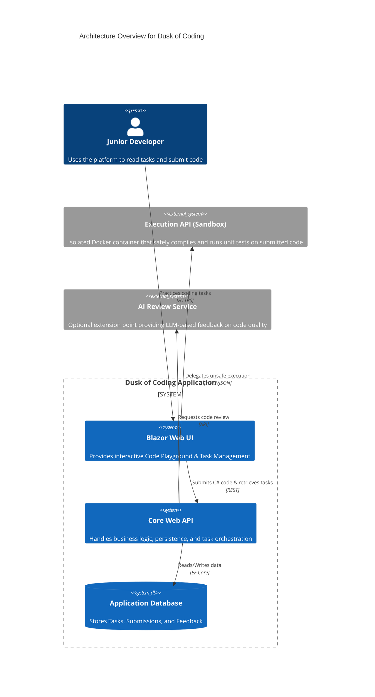

# Dusk of Coding

> **Disclaimer on Methodology:** This repository serves as an experimental proof-of-concept. Its architecture and implementation were born from the exploratory development paradigm of "vibecoding," operating in close synergy with the Antigravity AI agent to rapidly prototype and synthesize complex system capabilities.

*Master the craft. Wield the tool.*

An **AI-awareness and code mastery platform** designed to prepare developers for the new dawn of software engineering.

## 🚀 Overview

The sun is setting on coding as we traditionally knew it. **Dusk of Coding** represents the twilight of the old way—where developers wrote every line by hand, unassisted. But dusk is not an ending; it is the transition into a new dawn. 

This platform exists at this crossroads, serving as a safe, sandboxed environment where developers can learn to build systems correctly while simultaneously learning to harness AI effectively.

The platform is designed to:
- **Build resilience** by presenting structured programming tasks that require deep architectural understanding.
- **Validate fundamentals** by compiling and executing C# code safely within a Docker sandbox.
- **Provide structured feedback** through automated unit tests rather than simple pass/fail metrics.
- **Teach the new literacy** through an MCP-enabled AI Tutor that mentors users using the Socratic method, ensuring they learn to direct AI rather than rely on it blindly.

## 🌌 Philosophy: AI is a Tool, Not a Brain

AI code generation is restructuring how software is conceived, written, tested, and maintained. Developers who treat AI as their brain will hit a ceiling—they will lose the ability to architect, debug, and reason about complex systems. 

At **Dusk of Coding**, we believe that AI is a power tool—like an IDE, a debugger, or a compiler. The developers who thrive in the new dawn will be those who master the fundamentals of software engineering *and* learn to wield AI as the most powerful tool in their arsenal.

## 🛠️ Built With

This project is built using modern .NET technologies and architectural patterns to ensure clarity, extensibility, and observability.

- **[.NET 10](https://dotnet.microsoft.com/)** - The core runtime for high-performance cross-platform execution.
- **[.NET Aspire](https://learn.microsoft.com/en-us/dotnet/aspire/)** - Orchestration and configuration as code (connecting UI, APIs, and DB).
- **[Blazor Server](https://dotnet.microsoft.com/apps/aspnet/web-apps/blazor)** - Driving the interactive Task Management and Code Playground UIs.
- **[Entity Framework Core](https://learn.microsoft.com/en-us/ef/core/)** - ORM for persistence, storing tasks, submissions, and execution results.
- **[Scalar](https://github.com/scalar/scalar)** - Modern OpenAPI documentation and testing for the API endpoints.
- **[OpenTelemetry](https://opentelemetry.io/)** - Comprehensive observability and telemetry integration via Aspire.
- **[Serilog](https://serilog.net/)** - Structured logging throughout the application.
- **[Docker](https://www.docker.com/)** - Used for the Execution API to safely sandbox external code compilation and testing.
- **[Roslyn Compiler](https://github.com/dotnet/roslyn)** - Integrated for C# syntax analysis, compilation diagnostics, and execution.

## 🏗 Architecture

The platform follows a **Modular Monolith** structure applying **Clean Architecture** principles.
It separates the main onboarding app from a dedicated **Execution API service**, which acts as a hard boundary for sandboxed code compilation and execution.

### High-Level Component Flow

