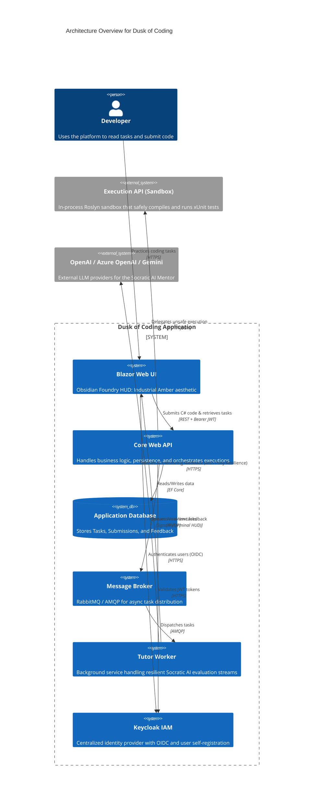

# Dusk of Coding

> **Disclaimer on Methodology:** This repository serves as an experimental proof-of-concept. Its architecture and implementation were born from the exploratory development paradigm of "vibecoding," operating in close synergy with AI agents to rapidly prototype and synthesize complex system capabilities.

*Master the craft. Wield the tool.*

An **AI-awareness and code mastery platform** designed to prepare developers for the new dawn of software engineering.

## 🚀 Overview

The sun is setting on coding as we traditionally knew it. **Dusk of Coding** represents the twilight of the old way—where developers wrote every line by hand, unassisted. But dusk is not an ending; it is the transition into a new dawn. 

This platform exists at this crossroads, serving as a safe, sandboxed environment where developers can learn to build systems correctly while simultaneously learning to harness AI effectively.

### ✨ Key Features

- **Sandboxed Execution Environment**: Compile and safely execute C# code within an isolated Docker sandbox using the Roslyn compiler.
- **Automated Testing & Feedback**: Receive detailed, structured feedback via automated unit tests instead of simple pass/fail metrics.
- **Socratic AI Mentor (TutorWorker)**: Connects to OpenAI, Azure OpenAI, or Google Gemini via a resilient Polly pipeline to provide real-time, streaming guidance. It teaches the "new literacy" by mentoring users using the Socratic method, ensuring they learn to direct AI rather than rely on it blindly.
- **Keycloak IAM**: Centralized authentication and user registration via OpenID Connect, with JWT-secured API access and self-service account creation.
- **Bilingual Industrial UI**: Fully localized in English and Hungarian.
- **Obsidian Foundry Aesthetic**: A complete visual unification leveraging the "Industrial Amber" design language—combining technical Geist Mono typography, high-contrast amber accents, and hard-edged tactical UI components for a premium engineering experience.

## 🌌 Philosophy: AI is a Tool, Not a Brain

AI code generation is restructuring how software is conceived, written, tested, and maintained. Developers who treat AI as their brain will hit a ceiling—they will lose the ability to architect, debug, and reason about complex systems. 

At **Dusk of Coding**, we believe that AI is a power tool—like an IDE, a debugger, or a compiler. The developers who thrive in the new dawn will be those who master the fundamentals of software engineering *and* learn to wield AI as the most powerful tool in their arsenal.

## 🛠️ Built With

This project is built using modern .NET technologies and architectural patterns to ensure clarity, extensibility, and observability.

- **[.NET 10](https://dotnet.microsoft.com/)** - The core runtime for high-performance cross-platform execution.
- **[.NET Aspire](https://learn.microsoft.com/en-us/dotnet/aspire/)** - Orchestration and configuration as code (connecting UI, APIs, AI workers, and DB).
- **[Blazor Server](https://dotnet.microsoft.com/apps/aspnet/web-apps/blazor)** - Driving the interactive Code Playground and Task Management interfaces.
- **[Entity Framework Core](https://learn.microsoft.com/en-us/ef/core/)** - ORM for persistence, storing tasks, submissions, and execution results.
- **[Microsoft.Extensions.AI](https://learn.microsoft.com/en-us/dotnet/ai/)** - Unified `IChatClient` abstraction powering the AI Tutor with pluggable providers (OpenAI, Azure OpenAI, Google Gemini).
- **[Polly](https://github.com/App-vNext/Polly)** - Used extensively in the AI and execution pipelines for retries, timeouts, and fallbacks to ensure robust API resilience.
- **[Podman / Docker](https://podman.io/)** - Container runtime for infrastructure services (Keycloak, RabbitMQ) via Aspire orchestration.
- **[Roslyn Compiler](https://github.com/dotnet/roslyn)** - Integrated for C# syntax analysis, compilation diagnostics, and execution.
- **[Keycloak](https://www.keycloak.org/)** - Open-source IAM providing centralized authentication, user registration, and JWT-based authorization via OpenID Connect.
- **[RabbitMQ](https://www.rabbitmq.com/)** - Message broker providing the AMQP backbone for asynchronous communication between the Core API and the AI Tutor workers.

## 🏗 Architecture

The platform follows a **Modular Monolith** structure applying **Clean Architecture** principles.
It separates the main onboarding app from a dedicated **Execution API service** (for sandboxed code compilation) and a **Tutor Worker service** (for AI mentoring).

### High-Level Component Flow

## 📜 Development History (Prompt Progression)

This project was built iteratively using a sequence of specialized AI prompts. Completed phases are located in the `_ArchivePrompts` directory, while active or recent prompts remain in the root directory. The chronological sequence reflects the evolution of the application:

1. **Architecture (`_ArchivePrompts/phase1-*`)**
   - **Goal:** Initial application scaffolding. Setting up the Blazor Server UI, the Core WebAPI, Entity Framework database connection, and the basic structure of the Modular Monolith architecture.
2. **Advanced (`_ArchivePrompts/phase2-*`)**
   - **Goal:** Complex backend features. Introduced the isolated Docker/Roslyn code execution sandbox, as well as the background AI `TutorWorker` integrating OpenAI/Azure OpenAI with Polly resilience pipelines.
3. **Localization (`_ArchivePrompts/phase3-*`)**
   - **Goal:** Bilingual support (English & Hungarian). Implementing the resource `.resx` files and the Blazor globalization services.
4. **Rebrand (`_ArchivePrompts/phase4-*`)**
   - **Goal:** Structural identity change. Transitioning the generic project name to **Dusk of Coding**, migrating away from the old sidebar layout to a new horizontal top navigation bar.
5. **Rebrand Page Modification (`_ArchivePrompts/phase5-*`)**
   - **Goal:** Premium UI Overhaul. Redesigning the visual identity to feature the dark mode glassmorphism aesthetic, building out the premium Landing Page, and fixing UX/UI contrast issues across the app.
6. **Keycloak (`_ArchivePrompts/phase6-*`)**
   - **Goal:** Centralized IAM with Keycloak. Setting up a Keycloak container in Aspire, securing the WebApi with JWT Bearer tokens, implementing OpenID Connect authentication in Blazor, adding user self-registration, and connecting the Landing Page "Get Started" flow to the Keycloak registration page.
7. **Execution & Persistence (`_ArchivePrompts/phase7-*`)**
   - **Goal:** Real execution engine and feedback persistence. Hardened the domain model with enums and immutability. Persisted feedback records via EF Core. Built the in-process Roslyn sandbox with `SecureCompilationService` (syntax analysis, safety rewriting) and `SandboxExecutionService` (collectible ALC, 5s timeout, memory limits). Wired Polly resilience to the Execution API HTTP client. Enhanced the Socratic Tutor prompt. Added Google Gemini as a third LLM provider via the OpenAI API compatibility layer.
8. **Error Handling & Resilience (`_ArchivePrompts/phase8-*`)**
   - **Goal:** Replace the default Blazor error bar with a premium branded `<ErrorBoundary>`. Implement a custom `AuthDelegatingHandler` for graceful 401/403 handling. Create a branded "Access Denied" page.
9. **RBAC & Identity UX (`_ArchivePrompts/phase9-*`)**
   - **Goal:** Introduce `admin` and `student` Keycloak roles with proper JWT claim mapping. Refactor the Landing Page and Navigation with `<AuthorizeView>`. Build an Admin Dashboard with aggregate student analytics.
10. **HTTP 431 Resolution (`_ArchivePrompts/phase10-*`)**
    - **Goal:** Permanently resolve "Request Header Too Large" errors by implementing memory-based `ITicketStore` for OIDC tokens and proactive cookie cleanup.
11. **User Feedback System (`_ArchivePrompts/phase11-*`)**
    - **Goal:** Comprehensive student feedback management, allowing task ratings and comments with admin-facing aggregate analytics.
12. **Keycloak Security Hardening (`_ArchivePrompts/phase12-*`)**
    - **Goal:** Systematic repair of the authentication pipeline, addressing WebSocket state issues, multi-network trust chains, and standardizing OIDC role mapping.
13. **EF Core Concurrency Resolution (`_ArchivePrompts/phase13-*`)**
    - **Goal:** Resolve `DbUpdateConcurrencyException` errors in `SubmissionService` and `TaskService`. Map DTOs onto tracked entities instead of replacing objects.
14. **RBAC & AI Refactor (`_ArchivePrompts/phase14-*`)**
    - **Goal:** Role refactoring (admin to tutor), fixed OIDC claim mapping, and optimized the Socratic Tutor with Hungarian-language support.
15. **Technical Dossier: How It Was Made (`_ArchivePrompts/phase15-*` & `phase16-*`)**
    - **Goal:** A premium storytelling page at `/how-it-was-made`. Explaining the iterative prompt-driven development and elevating localization to a world-class poetic standard.
16. **Engineering Cockpit UI (`_ArchivePrompts/phase17-*`)**
    - **Goal:** High-density, "Industrial Amber" themed HUD for the platform, focusing on interactive circuitry backgrounds and tactical mechanical UI components.
17. **Global Design Unification (`_ArchivePrompts/phase18-*`)**
    - **Goal:** Established the **Obsidian Foundry** design system. Centralized all styles in global `--ck-*` tokens, enforced strict CSS Isolation, and removed legacy glassmorphism in favor of a hard-edged industrial aesthetic.
18. **Landing Page Rebuild (`_ArchivePrompts/phase19-*`)**
    - **Goal:** Reconstructed the Landing Page from the ground up to match the Engineering Cockpit. Implemented a zero-JS animated PCB hero section and unified the visual identity across the entire public entry point.
19. **Engineering Dossier: How It Was Made Rebuild (`phase20-*`)**
    - **Goal:** Complete overhaul of the `/how-it-was-made` storytelling page. Replaced the cinematic glassmorphism aesthetic (Phase 15/16) with the **Obsidian Foundry Engineering Dossier** design language — a classified briefing aesthetic fully consistent with the Cockpit. Added three formal incident panels documenting the platform's critical failures (HTTP 431, Dual-Network Illusion, EF Core Concurrency Collapse), a vertical phase-by-phase build log, a CSS-only terminal typing animation, and a Field Manual prompt gallery. Deeply revised and tuned both the English and Hungarian localization for precision and authenticity.
