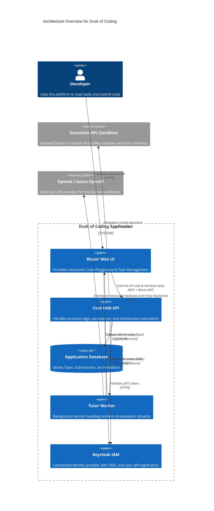

# Dusk of Coding

> **Disclaimer on Methodology:** This repository serves as an experimental proof-of-concept. Its architecture and implementation were born from the exploratory development paradigm of "vibecoding," operating in close synergy with AI agents to rapidly prototype and synthesize complex system capabilities.

*Master the craft. Wield the tool.*

An **AI-awareness and code mastery platform** designed to prepare developers for the new dawn of software engineering.

## 🚀 Overview

The sun is setting on coding as we traditionally knew it. **Dusk of Coding** represents the twilight of the old way—where developers wrote every line by hand, unassisted. But dusk is not an ending; it is the transition into a new dawn. 

This platform exists at this crossroads, serving as a safe, sandboxed environment where developers can learn to build systems correctly while simultaneously learning to harness AI effectively.

### ✨ Key Features

- **Sandboxed Execution Environment**: Compile and safely execute C# code within an isolated Docker sandbox using the Roslyn compiler.
- **Automated Testing & Feedback**: Receive detailed, structured feedback via automated unit tests instead of simple pass/fail metrics.
- **Socratic AI Mentor (TutorWorker)**: Connects to OpenAI and Azure OpenAI via a resilient Polly pipeline to provide real-time, streaming guidance. It teaches the "new literacy" by mentoring users using the Socratic method, ensuring they learn to direct AI rather than rely on it blindly.
- **Keycloak IAM**: Centralized authentication and user registration via OpenID Connect, with JWT-secured API access and self-service account creation.
- **Bilingual Premium UI**: Fully localized in English and Hungarian.
- **Modern Dark Aesthetic**: A fully redesigned user interface leveraging glassmorphism, responsive micro-animations, and curated vibrant color palettes to provide a dynamic and visually stunning experience.

## 🌌 Philosophy: AI is a Tool, Not a Brain

AI code generation is restructuring how software is conceived, written, tested, and maintained. Developers who treat AI as their brain will hit a ceiling—they will lose the ability to architect, debug, and reason about complex systems. 

At **Dusk of Coding**, we believe that AI is a power tool—like an IDE, a debugger, or a compiler. The developers who thrive in the new dawn will be those who master the fundamentals of software engineering *and* learn to wield AI as the most powerful tool in their arsenal.

## 🛠️ Built With

This project is built using modern .NET technologies and architectural patterns to ensure clarity, extensibility, and observability.

- **[.NET 10](https://dotnet.microsoft.com/)** - The core runtime for high-performance cross-platform execution.
- **[.NET Aspire](https://learn.microsoft.com/en-us/dotnet/aspire/)** - Orchestration and configuration as code (connecting UI, APIs, AI workers, and DB).
- **[Blazor Server](https://dotnet.microsoft.com/apps/aspnet/web-apps/blazor)** - Driving the interactive Code Playground and Task Management interfaces.
- **[Entity Framework Core](https://learn.microsoft.com/en-us/ef/core/)** - ORM for persistence, storing tasks, submissions, and execution results.
- **[Semantic Kernel / Azure OpenAI](https://learn.microsoft.com/en-us/semantic-kernel/)** - Powering the intelligent, context-aware AI Tutor.
- **[Polly](https://github.com/App-vNext/Polly)** - Used extensively in the AI pipeline for retries, timeouts, and fallbacks to ensure robust API resilience.
- **[Docker](https://www.docker.com/)** - Used for the Execution API to safely sandbox external code compilation and testing.
- **[Roslyn Compiler](https://github.com/dotnet/roslyn)** - Integrated for C# syntax analysis, compilation diagnostics, and execution.
- **[Keycloak](https://www.keycloak.org/)** - Open-source IAM providing centralized authentication, user registration, and JWT-based authorization via OpenID Connect.

## 🏗 Architecture

The platform follows a **Modular Monolith** structure applying **Clean Architecture** principles.
It separates the main onboarding app from a dedicated **Execution API service** (for sandboxed code compilation) and a **Tutor Worker service** (for AI mentoring).

### High-Level Component Flow

## 📜 Development History (Prompt Progression)

This project was built iteratively using a sequence of specialized AI prompts located in the `_ArchivePromts` directory. The chronological sequence reflects the evolution of the application:

1. **Master (`master promt.md` / `context.md` / `PHASE1-Architecture.md`)**
   - **Goal:** Initial application scaffolding. Setting up the Blazor Server UI, the Core WebAPI, Entity Framework database connection, and the basic structure of the Modular Monolith architecture.
2. **Advanced (`advanced-master-promt.md` / `advanced-context.md`)**
   - **Goal:** Complex backend features. Introduced the isolated Docker/Roslyn code execution sandbox, as well as the background AI `TutorWorker` integrating OpenAI/Azure OpenAI with Polly resilience pipelines.
3. **Localization (`localization-master-promt.md` / `localization-context.md`)**
   - **Goal:** Bilingual support (English & Hungarian). Implementing the resource `.resx` files and the Blazor globalization services.
4. **Rebrand (`rebrand-master-promt.md` / `rebrand-context.md`)**
   - **Goal:** Structural identity change. Transitioning the generic project name to **Dusk of Coding**, migrating away from the old sidebar layout to a new horizontal top navigation bar.
5. **Rebrand Page Modification (`rebrand-page-modification-master-prompt.md` / `rebrand-page-modification-context.md` / `landing-page.md`)**
   - **Goal:** Premium UI Overhaul. Redesigning the visual identity to feature the dark mode glassmorphism aesthetic, building out the premium Landing Page, and fixing UX/UI contrast issues across the app.
6. **Keycloak (`keycloak-master-prompt.md` / `keycloak-context.md`)**
   - **Goal:** Centralized IAM with Keycloak. Setting up a Keycloak container in Aspire, securing the WebApi with JWT Bearer tokens, implementing OpenID Connect authentication in Blazor, adding user self-registration, and connecting the Landing Page "Get Started" flow to the Keycloak registration page.
