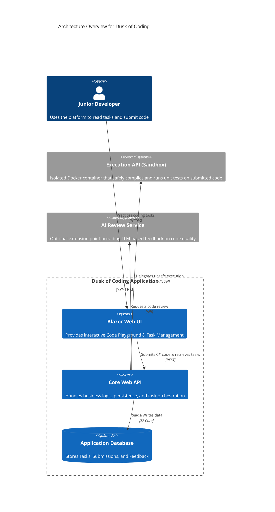

# Dusk of Coding

> **Disclaimer on Methodology:** This repository serves as an experimental proof-of-concept. Its architecture and implementation were born from the exploratory development paradigm of "vibecoding," operating in close synergy with the Antigravity AI agent to rapidly prototype and synthesize complex system capabilities.

An internal AI-aware .NET junior onboarding platform and code execution environment.

## 🚀 Overview

Dusk of Coding is a Proof of Concept (POC) designed to evaluate and onboard junior developers. 
It provides a safe, sandboxed environment for presenting programming tasks and reviewing user-submitted code. 

The platform is designed to:
- Present structured programming tasks.
- Accept and validate user-submitted C# code.
- Compile and execute code safely within a sandbox.
- Run automated unit tests against submissions.
- Provide detailed, structured feedback rather than simple pass/fail metrics.
- Support future integration of AI-assisted code reviews.

## 🛠️ Built With

This project is built using modern .NET technologies and architectural patterns to ensure clarity, extensibility, and observability.

- **[.NET 10](https://dotnet.microsoft.com/)** - The core runtime for high-performance cross-platform execution.
- **[.NET Aspire](https://learn.microsoft.com/en-us/dotnet/aspire/)** - Orchestration and configuration as code (connecting UI, APIs, and DB).
- **[Blazor Server](https://dotnet.microsoft.com/apps/aspnet/web-apps/blazor)** - Driving the interactive Task Management and Code Playground UIs.
- **[Entity Framework Core](https://learn.microsoft.com/en-us/ef/core/)** - ORM for persistence, storing tasks, submissions, and execution results.
- **[Scalar](https://github.com/scalar/scalar)** - Modern OpenAPI documentation and testing for the API endpoints.
- **[OpenTelemetry](https://opentelemetry.io/)** - Comprehensive observability and telemetry integration via Aspire.
- **[Serilog](https://serilog.net/)** - Structured logging throughout the application.
- **[Docker](https://www.docker.com/)** - Used for the Execution API to safely sandbox external code compilation and testing.
- **[Roslyn Compiler](https://github.com/dotnet/roslyn)** - Integrated for C# syntax analysis, compilation diagnostics, and execution.

## 🏗 Architecture

The platform follows a **Modular Monolith** structure applying **Clean Architecture** principles.
It separates the main onboarding app from a dedicated **Execution API service**, which acts as a hard boundary for sandboxed code compilation and execution.

### High-Level Component Flow

