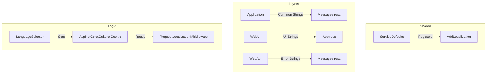

# Localization Context — Dusk of Coding

> **Last updated**: 2026-03-14  
> **Branch**: `feature/localization`
> **Target Languages**: English (en), Hungarian (hu)

---

## Localization Overview

The platform is moving to a bilingual model to support the **Dusk of Coding** mission in both international and local (Hungarian) contexts. 

### Why Hungarian?
The `dusk-of-coding.eu` domain focuses on the European region, with a specific initial focus on the Hungarian developer community to promote AI awareness and code-learning in their native language.

---

## Architecture for Localization

---

## Resource Namespaces

- **WebUi**: `Dusk of Coding.WebUi.Resources.App`
- **Application**: `Dusk of Coding.Application.Resources.Messages`
- **WebApi**: `Dusk of Coding.WebApi.Resources.Messages`

---

## Key Translations (Baseline)

| English | Hungarian | Context |
|---|---|---|
| Submit Code | Kód beküldése | Button |
| AI Tutor | MI Mentor | Title |
| Thinking... | Gondolkodik... | Status |
| Diagnostics | Diagnosztika | Label |
| Socratic Method | Szókratészi módszer | Philosophy |
| The sun is setting on coding. | Lemegy a nap a kódolás felett. | Brand |

---

## Phase 7 Tracking: Localization

| Item | Description | Status |
|---|---|---|
| Core Setup | Localization middleware & services | 🔲 Not started |
| Resource Files | .resx structure created | 🔲 Not started |
| UI Refactor | Blazor pages using Localizer | 🔲 Not started |
| API Refactor | Localized error messages | 🔲 Not started |
| Language Selector | Toggle in header | 🔲 Not started |

---

## Resumption Point (2026-03-14 12:50)

**Next Action**: Initialize `IStringLocalizer` configuration in `ServiceDefaults`.

### Git state
- **Branch**: `feature/localization`
- **Build**: ✅ Verified stable (Phase 6 baseline)
