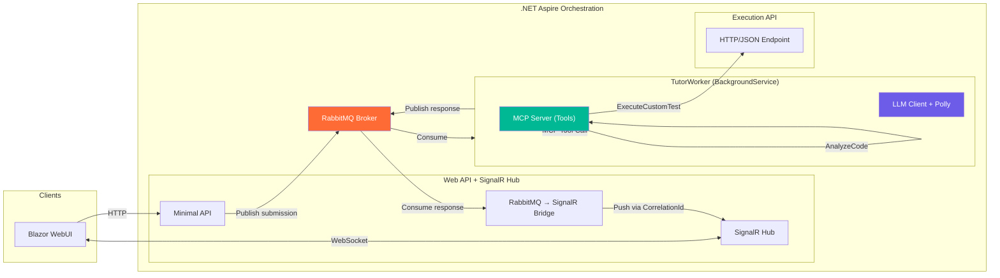

# Advanced Context — AI-Tutor Platform

> **Last updated**: 2026-03-12  
> **Branch**: `feature/ai-tutor-platform`

---

## Architecture Overview

The PracticePlatform is being evolved from a **Modular Monolith POC** into an **Interactive AI-Tutor Platform** using:

- **RabbitMQ** (official `RabbitMQ.Client`) for async messaging
- **MCP** (Model Context Protocol) for LLM ↔ Roslyn/Sandbox tool calling
- **Polly** (v8+ Strategy API) for retry, circuit breaker, timeout, and fallback
- **SignalR** for real-time Blazor UI updates

---

## Phase Tracking

| Phase | Description | Status |
|-------|-------------|--------|
| 0 | Branch & Tracking Setup | ✅ Done |
| 1 | Native RabbitMQ & Polly Connection Strategy | ✅ Done |
| 2 | MCP-Enabled Worker with Fallback | ✅ Done |
| 3 | Resilient LLM Loop | ✅ Done |
| 4 | Blazor WebUI & SignalR Bridge | 🔲 Not started |
| 5 | Sandboxing & Safety | 🔲 Not started |
| 6 | End-to-End Verification | 🔲 Not started |

---

## Existing Project Structure

| Project | Role |
|---------|------|
| `PracticePlatform.AppHost` | Aspire orchestrator |
| `PracticePlatform.ServiceDefaults` | Shared Aspire defaults |
| `PracticePlatform.Domain` | Entities, interfaces, models |
| `PracticePlatform.Application` | Services (SubmissionService, TaskService) |
| `PracticePlatform.Infrastructure` | EF Core, HTTP execution engine, AI review |
| `PracticePlatform.WebApi` | Minimal API endpoints |
| `PracticePlatform.WebUi` | Blazor Server frontend |
| `PracticePlatform.ExecutionApi` | Sandboxed code execution (stub) |
| `PracticePlatform.Execution.Contracts` | Shared DTOs for execution |

---

## Technical Constraints

- **Runtime**: .NET 10
- **Messaging**: Official `RabbitMQ.Client` (no MassTransit)
- **Background Logic**: Standard `BackgroundService`
- **Resiliency**: Polly v8+ Strategy-based API
- **AI Protocol**: MCP for Tool Calling
- **Prefer**: `Microsoft.Extensions.*` standard libraries
- **Aspire**: Wire everything in the AppHost

---

## Key Decisions Log

| Date | Decision |
|------|----------|
| 2026-03-12 | Created `feature/ai-tutor-platform` branch from `main` |
| 2026-03-12 | Phase 1 before Phase 2 (dependency order) |
| 2026-03-12 | Phase 1 done: RabbitMQ.Client 7.2.1, Polly 10.4.0, Aspire.RabbitMQ.Client 13.1.2 |
| 2026-03-12 | Phase 2 done: ModelContextProtocol 1.1.0, TutorWorker BackgroundService with MCP tools |
| 2026-03-12 | Phase 3 done: IChatClient with switchable OpenAI/AzureOpenAI, Polly retry+timeout, Socratic Tutor prompt |
