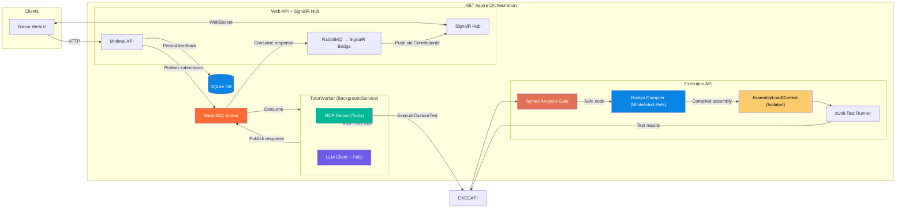

# Phase 2 Context — Execution Engine, Persistence & Domain Hardening

> **Last updated**: 2026-03-19
> **Source**: `phase2-master-promt.md`

---

## Architecture Overview

Building on the existing AI-Tutor Platform, Phase 2 replaces the stubbed Execution API with a **Roslyn-based sandbox** that compiles student code against a **whitelisted assembly set**, generates xUnit tests on the fly, executes them in an isolated `AssemblyLoadContext`, and returns pass/fail results. Feedback is persisted to the database and the domain model is hardened.

---

## Security Model

| Layer | Mechanism | What it Prevents |
|-------|-----------|-----------------|
| 1. Compile-time whitelist | Only whitelisted `MetadataReference`s in Roslyn compilation | File I/O, network, process spawning, P/Invoke |
| 2. Syntax analysis | Reject `unsafe`, pointers, `DllImport`, **Reflection**, `goto`, broad `catch` | Sandbox bypass, native execution, swallowed timeouts |
| 3a. Loop rewriting | Inject `ThrowIfCancellationRequested()` into every loop body | Infinite loops (`while(true){}`) |
| 3b. Recursion depth | Inject call-depth counter into every method (limit: 200) | Infinite recursion / fatal `StackOverflowException` |
| 4. Runtime protection | 5s timeout + `GetAllocatedBytesForCurrentThread` (50 MB) + ALC unload | Hangs, memory bombs, assembly leaks (⚠️ In-process thread leak risk accepted) |
| 5. Concurrency limit | `SemaphoreSlim` (configurable, default: 5) | Resource exhaustion from concurrent submissions |

---

## 📈 Phase Tracking

| Phase | Description | Status |
|-------|-------------|--------|
| 1 | Domain Model Hardening (enum, mutability, rename) | ⬜ Not Started |
| 2 | Feedback Persistence (EF entity, migration) | ⬜ Not Started |
| 3 | Real Execution Engine (Roslyn sandbox, test gen, xUnit runner) | ⬜ Not Started |
| 4 | Integration Wiring (connect engine to services & UI) | ⬜ Not Started |
| 5 | End-to-End Verification | ⬜ Not Started |

---

## Technical Constraints

- **Runtime**: .NET 10
- **Execution**: Roslyn in-process + AssemblyLoadContext (NO Docker/Podman)
- **Messaging**: Official `RabbitMQ.Client` (no MassTransit)
- **Background Logic**: Standard `BackgroundService`
- **Resiliency**: Polly v8+ Strategy-based API
- **ORM**: Entity Framework Core (SQLite for dev, PostgreSQL for prod)
- **Prefer**: `Microsoft.Extensions.*` standard libraries
- **Aspire**: Wire everything in the AppHost
- **Deployment targets**: On-premise (VM) and Azure

---

## Key Decisions Log

| Date | Decision |
|------|----------|
| 2026-03-19 | Phase 2 work initiated — assessed current project gaps |
| 2026-03-19 | Rejected Podman — doesn't work inside containers (Azure, K8s) |
| 2026-03-19 | Chosen Roslyn compile-time whitelist as primary security boundary |
| 2026-03-19 | Updated Sandbox Rules: Block Reflection & swallow-catch to patch security holes |
| 2026-03-19 | Tests run via pure Reflection `Invoke` (xUnit util requires disk I/O) |
| 2026-03-19 | Thread memory tracking via `GC.GetAllocatedBytesForCurrentThread()` |
| 2026-03-19 | Feedback to be persisted as `FeedbackRecord` EF entity with JSON-serialized lists |

---

## Resumption Point (2026-03-19 17:46)

**Phase 2 work has not yet started.** Master prompt and context created. Ready to begin Phase 1 (Domain Model Hardening).

### To resume
1. Read this `phase2-context.md` to understand current status
2. Begin with Phase 1 tasks from `phase2-master-promt.md`
3. Update this file at the end of every response
